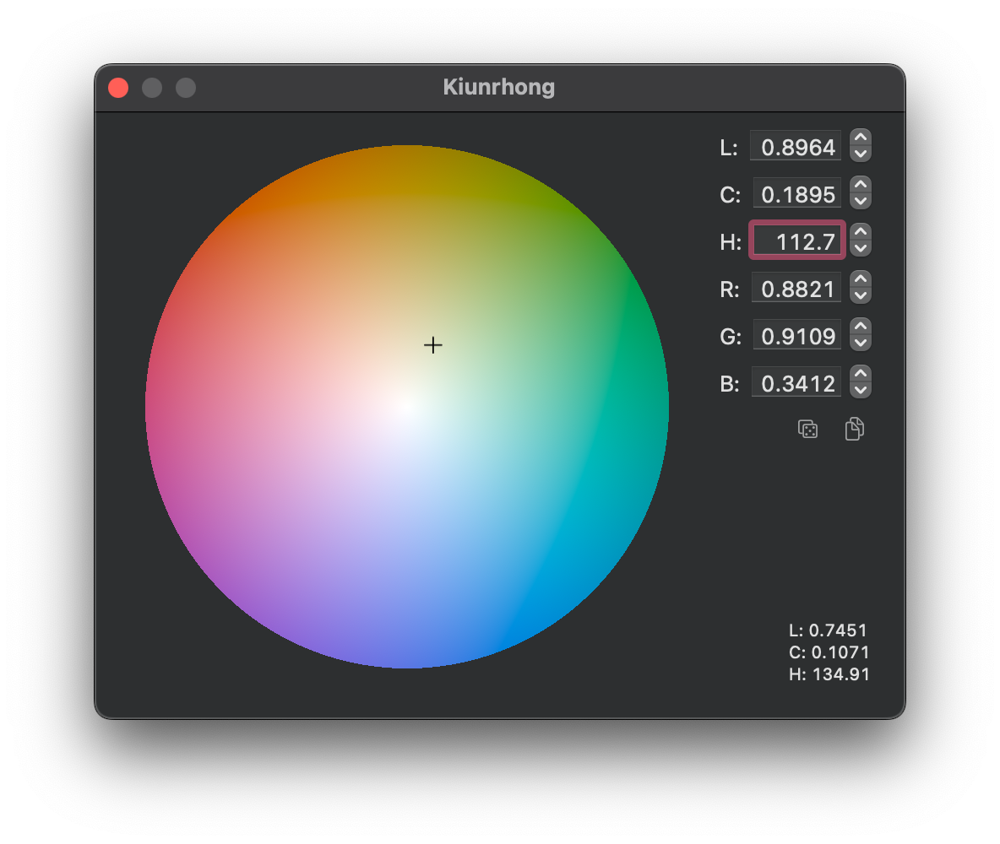

Kiunrhong
=========

Experimental wide gamut color picker, written in AppKit. The app utilizes various overkill features such as Metal-backed HDR color spectrum, OKLCH support, and possibly experimental Rec.2020 color conversion (not yet implemented).

Naming
------

虹 (<em lang="hak-tw">kīung</em>, *rainbow*)、共樣 (<em lang="hak-tw">kīung rhōng</em>, *the same*) as in Taiwanese Hakka.

References
----------

* W3C [CSS Color Module Level 4](https://www.w3.org/TR/css-color-4/) Specification
* [Björn Ottosson](https://github.com/bottosson)’s various articles on [Oklab](https://bottosson.github.io/posts/oklab/) and [Okhsv](https://bottosson.github.io/posts/colorpicker/)
* The [`coloraide`](https://facelessuser.github.io/coloraide/colors/) color space information and reference from [Issac Muse](https://github.com/facelessuser/)

License
-------

© Poren Chiang 2025. Released as free software under the [GNU GPL 3.0 Public License](./LICENSE.md).
